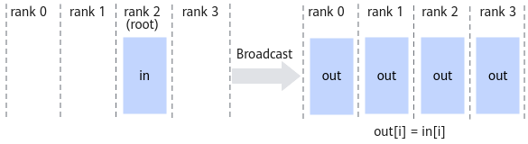
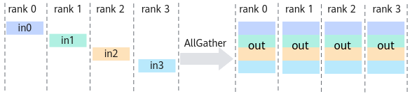
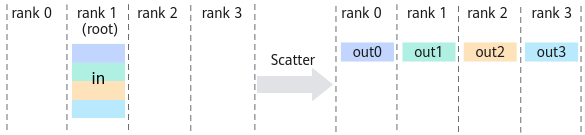
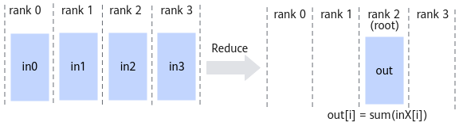
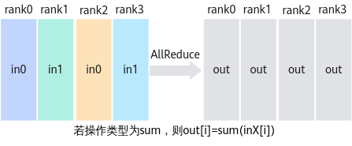
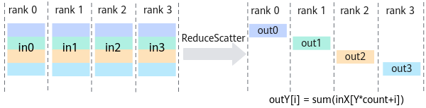
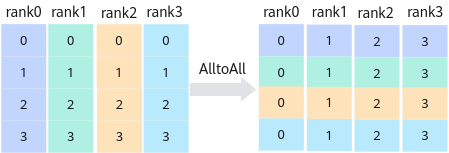

# 分布式集合通信（Collective Communication）

集合通信是分布式系统中一组进程之间进行通信的基本操作。这些操作在并行计算、深度学习训练等场景中发挥着重要作用。本文将介绍几种主要的集合通信操作。

## 基本概念

- **进程组（Process Group）**：参与通信的一组进程的集合
- **根进程（Root Process）**：在某些操作中作为数据源或目标的特定进程
- **通信域（Communicator）**：定义了进程组的上下文环境

## 主要集合通信操作

### 1. Broadcast（广播）

- **功能**：将根进程的数据发送给组内所有其他进程
- **应用场景**：参数初始化、配置分发
- **特点**：
  - 一对多通信
  - 所有非根进程接收相同的数据
  - 常用于模型参数的分发

### 2. Gather（收集）

- **功能**：将每个进程的数据收集到根进程
- **应用场景**：结果汇总、数据聚合
- **特点**：
  - 多对一通信
  - 根进程接收所有进程的数据
  - 数据按进程顺序排列

### 3. All-Gather（全收集）

- **功能**：将每个进程的数据收集到所有进程
- **应用场景**：需要所有进程获取完整信息的场景
- **特点**：
  - 多对多通信
  - 每个进程都获得相同的数据集
  - 相当于每个进程都执行一次Gather

### 4. Scatter（分散）

- **功能**：将根进程的数据分散到其他进程
- **应用场景**：数据并行处理、任务分配
- **特点**：
  - 一对多通信
  - 每个进程获得不同的数据片段
  - 常用于数据并行训练

### 5. Reduce（规约）

- **功能**：将每个进程的数据通过某种操作（如求和、求最大值等）规约到根进程
- **应用场景**：梯度聚合、统计计算
- **特点**：
  - 多对一通信
  - 支持多种规约操作（SUM、MAX、MIN等）
  - 常用于梯度同步

### 6. All-Reduce（全规约）

- **功能**：将规约结果分发到所有进程
- **应用场景**：分布式训练中的梯度同步
- **特点**：
  - 多对多通信
  - 所有进程获得相同的规约结果
  - 深度学习训练中最常用的操作之一

### 7. Reduce-Scatter（规约分散）

- **功能**：先执行规约操作，然后将结果分散到所有进程
- **应用场景**：大规模并行计算
- **特点**：
  - 结合了Reduce和Scatter的特点
  - 每个进程获得规约结果的一部分
  - 通信效率较高
如下图所示，有rank0、rank1、rank2、rank3四个rank，每个rank的输入数据切分成4份，每个进程分别取每个rank的1/4数据进行sum操作（或其他操作），将结果发送到输出buffer。

### 8. All-to-All（全对全）

- **功能**：每个进程向其他所有进程发送不同的数据
- **应用场景**：矩阵转置、数据重分布
- **特点**：
  - 最复杂的集合通信操作
  - 每个进程既是发送者也是接收者
  - 通信开销较大

## 实现优化

1. **通信算法优化**
   - 树形算法
   - 蝶形算法
   - 环形算法

2. **硬件加速**
   - 使用NCCL（NVIDIA Collective Communications Library）
   - 使用InfiniBand等高速网络
   - GPU Direct技术

3. **通信调度优化**
   - 通信与计算重叠
   - 通信流水线
   - 动态调度

## 应用场景

1. **深度学习训练**
   - 模型参数同步
   - 梯度聚合
   - 分布式优化

2. **科学计算**
   - 矩阵运算
   - 数值模拟
   - 大规模并行计算

3. **大数据处理**
   - 数据并行处理
   - 结果聚合
   - 分布式存储

## 性能考虑

1. **通信开销**
   - 延迟（Latency）
   - 带宽（Bandwidth）
   - 消息大小

2. **可扩展性**
   - 进程数量
   - 网络拓扑
   - 硬件限制

3. **容错性**
   - 通信失败处理
   - 进程故障恢复
   - 数据一致性

## 参考链接
https://www.hiascend.com/doc_center/source/zh/canncommercial/80RC3/developmentguide/hccl/hcclug/hcclug_000004.html
https://docs.nvidia.com/deeplearning/nccl/user-guide/docs/usage/collectives.html#allreduce