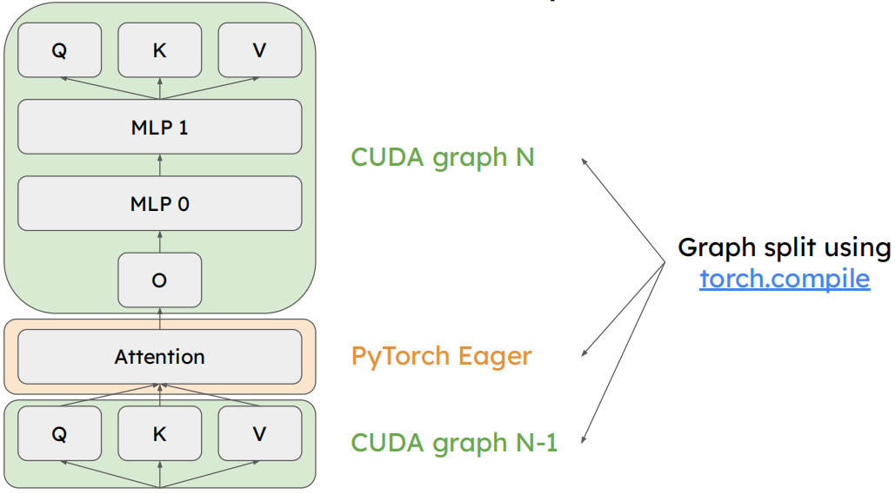
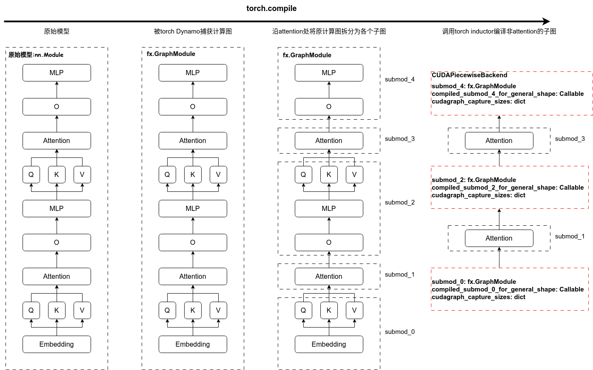

# vLLM Piecewise CUDA Graphs实现流程

(TODO：目前的水平只能通过阅读源码获取一个大致流程，后续一些技术细节还得再研究，这篇文档目前只考虑单机的情况)
随着attention的花活越来越多，比如chunked prefill, tree attention, paged attention等，里面复杂的分支、条件判断，变来变去的kv cache，使得其很难捕获cuda graph。
vLLM在v1时引入了Piecewise CUDA Graphs，沿着attention将模型切成各个sub mod，实际运行时非attention部分可以很好的捕获成cuda graph以加速运行，而attention部分则以eager mode方式运行。
在略微降低处理速度的情况下，极大降低了attention部分的开发难度，使得更多复杂的特性可以被实现。



## 前置知识
vLLM v1默认支持chunked prefill，所以模型的输入一开始就是给拼在一起的。比如seq1的token id [1,2,3],seq2的token id [4,5,6]，那么模型的输入就是[1,2,3,4,5,6]。
以Qwen2为例：
```python
class Qwen2Model(nn.Module):
    ......
    def forward(
        self,
        input_ids: torch.Tensor, # 1维张量，所有请求的token拼在一起的
        positions: torch.Tensor, # 1维张量，长度=input_ids，记录每个token的position供rope用
        intermediate_tensors: Optional[IntermediateTensors] = None, # 流水线并行用
        inputs_embeds: Optional[torch.Tensor] = None,
    ) -> Union[torch.Tensor, IntermediateTensors]:
    ......
```

在model runner层，也就是model的上一层，会在初始化时，根据max_num_batched_tokens，也就是一次前向处理的最大token数，预分配出对应长度的input_ids和positions。
再实际执行中，将所有请求的token和对应position放进去，然后截取对应长度的input_ids和positions作为入参传给model。
这样保证了模型每次执行时的入参指针是固定的，方便CUDA Graphs的实现。

```python
class GPUModelRunner(LoRAModelRunnerMixin):
    def __init__
        ......
        self.max_num_tokens = scheduler_config.max_num_batched_tokens
        ......
        # Persistent buffers for CUDA graphs.
        self.input_ids = torch.zeros(self.max_num_tokens,
                                     dtype=torch.int32,
                                     device=self.device)
        self.positions = torch.zeros(self.max_num_tokens,
                                     dtype=torch.int64,
                                     device=self.device)
```

## 相关配置
vLLM编译相关的配置记录在`vllm.config.CompilationConfig`中，这里主要关注以下几个配置：

- `cudagraph_capture_sizes`：用于指定捕获CUDA Graph时的所有入参长度。其含义如下：
    1. 如果没有提供该参数，则默认值为`[min(max_num_seqs * 2, 512)]`，即取最大请求数的2倍和512中的较小值。
    2. 如果只提供了一个数值（如128），则最终的捕获size列表为`[1, 2, 4]`加上从8开始到该数值（包含）且步长为8的所有整数，即`[1, 2, 4, 8, 16, ..., 128]`。
    3. 如果提供了多个数值（如`1 2 128`），则捕获size列表直接采用用户提供的列表，不做额外处理。

- `splitting_ops`：用于切分graph的op列表，默认是`["vllm.unified_attention", "vllm.unified_attention_with_output"]`
- `max_capture_size`: 最大捕获长度，`cudagraph_capture_sizes`的最大值
- `bs_to_padded_graph_size`: list[int]，`max_capture_size`长度的映射列表，供实际执行时，根据需要处理的token数去匹配对应的capture size.比如请求长度为10，cudagraph_capture_sizes为[1,2,4,8,16,32,64,128]，那么实际执行时，会匹配到16长度的cuda graph，然后打6个pad，让这次的处理token长度为16，对应的bs_to_padded_graph_size[10+1] = 16

## 整体流程
大体上分为两部分：
1. **torch.compile**：模型在定义时forward就被torch.compile包裹住了，在首次执行（profile_run,用于确定可用显存）时，GraphModule的分片、子图的编译就完成了，每个compiled_graph都会保存在PiecewiseBackend等着后续执行。
2. **cuda graph捕获**：按照cudagraph_capture_sizes里从大到小的尺寸一次捕获cuda graph，CUDAGraphWrapper控制捕获和执行流程。

### torch.compile部分

#### 前置工作
vLLM对torch.compile和cuda graph做了很好的封装，在定义模型时，只需要在类前添加@support_torch_compile装饰器，并指定dynamic_arg_dims参数，就可以让模型自动被torch.compile包裹住，并在后面capture_model时捕获cuda graph。

这里我们介绍下dynamic_arg_dims参数的作用，默认情况下，torch.compile 假设张量形状是静态的，当输入张量的形状发生变化时，会触发重新编译。可以通过 mark_dynamic 预先告诉编译器某些维度是动态的，生成可以处理不同形状的通用代码。
以Qwen2为例，在前面我们介绍了vLLM语言类模型的输入将batch_size和seq_len维度拼在一起，所以所有输入张量的第0维度都是动态的(position除外)
```python
@support_torch_compile(
    dynamic_arg_dims={
        "input_ids": 0,
        # positions is of shape (3, seq_len) if mrope is enabled for qwen2-vl,
        # otherwise (seq_len, ).
        "positions": -1,
        "intermediate_tensors": 0,
        "inputs_embeds": 0,
    })
class Qwen2Model(nn.Module):
    ......
```
support_torch_compile层级比较深，我们简单看下：

```python
# vllm/compilation/decorators.py
def support_torch_compile(
    cls: Optional[_T] = None,
    *,
    dynamic_arg_dims: Optional[dict[str, Union[int, list[int]]]] = None,
) -> Union[Callable[[_T], _T], _T]:

    def cls_decorator_helper(cls: _T) -> _T:
        if not hasattr(cls, 'forward'):
            raise TypeError("decorated class should have a forward method.")
        sig = inspect.signature(cls.forward)
        inferred_dynamic_arg_dims = dynamic_arg_dims
        ......
        #入参校验部分，忽略不看
        ......
        return _support_torch_compile(cls, inferred_dynamic_arg_dims)

    if cls is not None:
        # use `support_torch_compile` as a decorator without arguments
        assert isinstance(cls, type)
        return cls_decorator_helper(cls)

    return cls_decorator_helper
```

不难看出，实际调用的是`_support_torch_compile`，我们接着看下：
```python
# vllm/compilation/decorators.py
def _support_torch_compile(
    cls: _T,
    dynamic_arg_dims: dict[str, Union[int, list[int]]],
) -> _T:
    """
    A decorator to add support for compiling the forward method of a class.
    """
    if TorchCompileWrapperWithCustomDispatcher in cls.__bases__:
        # support decorating multiple times
        return cls

    # take care of method resolution order
    # make sure super().__init__ is called on the base class
    #  other than TorchCompileWrapperWithCustomDispatcher
    cls.__bases__ = cls.__bases__ + (TorchCompileWrapperWithCustomDispatcher, )

    old_init = cls.__init__

    def __init__(self, *, vllm_config: VllmConfig, prefix: str = '', **kwargs):
        old_init(self, vllm_config=vllm_config, prefix=prefix, **kwargs)
        self.vllm_config = vllm_config
        # for CompilationLevel.DYNAMO_AS_IS , the upper level model runner
        # will handle the compilation, so we don't need to do anything here.
        self.do_not_compile = \
            vllm_config.compilation_config.level in [
            CompilationLevel.NO_COMPILATION, CompilationLevel.DYNAMO_AS_IS
        ] or not supports_dynamo()
        if self.do_not_compile:
            return
        compilation_counter.num_models_seen += 1
        TorchCompileWrapperWithCustomDispatcher.__init__(
            self, compilation_level=vllm_config.compilation_config.level)

    cls.__init__ = __init__

    def __call__(self, *args, **kwargs):
        ......

    cls.__call__ = __call__
    return cls
```

`_support_torch_compile`在原有模型类的基类里添加了`TorchCompileWrapperWithCustomDispatcher`，并重载了`__init__`和`__call__`方法。
`TorchCompileWrapperWithCustomDispatcher`主要就是torch.compile实现和实际执行时code的分发。这里`__call__`方法我们暂不展开。

```python
# vllm/compilation/wrapper.py
class TorchCompileWrapperWithCustomDispatcher:
    """
    A wrapper class for torch.compile, with a custom dispatch logic.
    Subclasses should:
    1. Implement the forward method
    2. Implement the dispatch logic in the __call__ method
        It can use `self.compiled_codes` to access the compiled bytecode,
        and `with self.dispatch_to_code(index):` to dispatch to
        the compiled code.
    3. Implement the `__init__` method to determine how to call
        `torch.compile` over the forward method.
    """

    def __init__(self,
                 compiled_callable: Optional[Callable] = None,
                 compilation_level: int = 0):

        vllm_config = get_current_vllm_config()
        self.vllm_config = vllm_config
        if compiled_callable is None:
            # default compilation settings
            # compiling the forward method
            # ===================================
            # 根据配置初始化backend
            # ===================================
            backend = vllm_config.compilation_config.init_backend(vllm_config)
            options = None
            if isinstance(backend, str) and backend == "inductor":
                options = get_current_vllm_config(
                ).compilation_config.inductor_compile_config
            # ===================================
            # 这里将模型的forward方法用torch.compile包裹，并返回一个可调用对象
            # ===================================
            compiled_callable = torch.compile(
                self.forward,
                fullgraph=envs.VLLM_TEST_DYNAMO_FULLGRAPH_CAPTURE,
                backend=backend,
                options=options)

        self.compiled_callable = compiled_callable
        # ===================================
        # 保存原始模型forward
        # ===================================
        self.original_code_object = self.__class__.forward.__code__
        # ===================================
        # 保存编译后的模型forward，初始化时还没触发编译，此处为空
        # ===================================
        self.compiled_codes: list[CodeType] = []
        # ===================================
        # 注册bytecode_hook，在backend编译完返回Dynamo后调用此hook
        # ===================================
        torch._dynamo.convert_frame.register_bytecode_hook(self.bytecode_hook)

        # read the env var to determine whether to use the custom dispatcher
        # subclasses can use this to switch between the custom dispatcher
        # and the default Dynamo guard mechanism.
        self.use_custom_dispatcher: bool = \
            compilation_level >= CompilationLevel.DYNAMO_ONCE

    def __call__(self, *args, **kwargs):
        """Implement the dispatch logic here, beyond the torch.compile level.
        NOTE: this function can have additional arguments beyond the forward
         method, for directly dispatching to the compiled code.
        """
        return self.compiled_callable(*args, **kwargs)

    @abstractmethod
    def forward(self, *args, **kwargs):
        ...

    def bytecode_hook(self, old_code: CodeType, new_code: CodeType):
        """Hook to save the compiled bytecode for direct execution."""
        # 首先检查被编译的代码是否是当前类的 forward 方法，如果不是就直接返回，确保只处理相关的代码转换。
        if old_code is not self.original_code_object:
            return
        # code borrowed from https://github.com/thuml/depyf/blob/f4ad79fadee27ea113b4c75202db1eb1a11c0dbc/depyf/explain/enable_debugging.py#L25
        # 通过遍历调用堆栈，找到 Dynamo 编译器的内部调用上下文，确保这次编译确实是针对当前对象的
        frame = sys._getframe()
        while frame and frame.f_back:
            frame = frame.f_back
            code_name = frame.f_code.co_name
            file_name = frame.f_code.co_filename.split(os.path.sep)[-1]
            if code_name == "_compile" and file_name == "convert_frame.py":
                break
        frame = frame.f_locals["frame"]
        assert frame.f_code == old_code

        if frame.f_locals["self"] is not self:
            return

        # ===================================
        # 此处保存backend返回的可执行对象，后续直接执行
        # ===================================
        self.compiled_codes.append(new_code)
        # 如果配置了本地缓存目录，会使用 depyf 库将编译后的字节码反编译回 Python 源码并保存到文件中，用于调试和分析
        local_cache_dir = self.vllm_config.compilation_config.local_cache_dir
        if isinstance(local_cache_dir, str):
            decompiled_file = os.path.join(local_cache_dir,
                                           "transformed_code.py")
            if not os.path.exists(decompiled_file):
                try:
                    # usually the decompilation will succeed for most models,
                    # as we guarantee a full-graph compilation in Dynamo.
                    # but there's no 100% guarantee, since decompliation is
                    # not a reversible process.
                    import depyf
                    src = depyf.decompile(new_code)
                    with open(decompiled_file, "w") as f:
                        f.write(src)

                    logger.debug("Dynamo transformed code saved to %s",
                                 decompiled_file)
                except Exception:
                    pass

        # 当启用 CUDA graph 时，检查编译后的代码中是否包含 update 操作，如果有则抛出错误，因为 CUDA graph 模式下不允许在 forward 过程中修改 nn.Module 的缓冲区。
        if self.vllm_config.compilation_config.use_cudagraph and \
            "update" in new_code.co_names:
            import depyf
            src = depyf.decompile(new_code)
            msg = "Assigning / modifying buffers of nn.Module during forward pass is not allowed when using cudagraph inside the compiler because it will cause silent errors. Please use eager mode or fix the code. The following code contains clues about which buffer is being modified (please search for the usage of the function `update`):\n" + src  # noqa
            raise RuntimeError(msg)

    @contextmanager
    def dispatch_to_code(self, index: int):
        # 这里实现了code的切换，等compiled_codes生成后，后续模型的执行都会切换到compiled_codes
        """Context manager to dispatch to the compiled code.
        Why does this work? Because Dynamo guarantees that the compiled
        bytecode has exactly the same arguments, cell variables, and free
        variables as the original code. Therefore we can directly switch
        the code object in the function and call it.

        See https://dev-discuss.pytorch.org/t/what-is-the-relationship-requirement-among-original-bytecode-transformed-bytecode-and-bytecode-returned-by-hooks-in-dynamo/1693/7 for more details.
        """ # noqa
        self.__class__.forward.__code__ = self.compiled_codes[index]
        yield
        self.__class__.forward.__code__ = self.original_code_object
```
看到这里，我们大致了解了vLLM在那边用torch.compile封装了模型，以及如何获取和分发编译的结果，现在我们可以回到_support_torch_compile看下它的`__call__`实现，实际执行模型时就是从这边进入。

```python
# vllm/compilation/decorators.py
def _support_torch_compile(
    cls: _T,
    dynamic_arg_dims: dict[str, Union[int, list[int]]],
) -> _T:
    ......
    def __call__(self, *args, **kwargs):
        # torch.compiler.is_compiling() means we are inside the compilation
        # e.g. TPU has the compilation logic in model runner, so we don't
        # need to compile the model inside.
        if self.do_not_compile or torch.compiler.is_compiling():
            return self.forward(*args, **kwargs)

        # the first compilation needs to have dynamic shapes marked
        # ===================================
        # self.compiled_codes为空，说明是第一次编译，需要标记动态shape
        # ===================================
        if len(self.compiled_codes) < 1:
            sig = inspect.signature(self.__class__.forward)
            bound_args = sig.bind(self, *args, **kwargs)
            bound_args.apply_defaults()
            for k, dims in dynamic_arg_dims.items():
                arg = bound_args.arguments.get(k)
                if arg is not None:
                    dims = [dims] if isinstance(dims, int) else dims
                    if isinstance(arg, torch.Tensor):
                        # In case dims is specified with negative indexing
                        dims = [
                            arg.ndim + dim if dim < 0 else dim for dim in dims
                        ]
                        torch._dynamo.mark_dynamic(arg, dims)
                    elif isinstance(arg, IntermediateTensors):
                        for tensor in arg.tensors.values():
                            # In case dims is specified with negative indexing
                            dims = [
                                tensor.ndim + dim if dim < 0 else dim
                                for dim in dims
                            ]
                            torch._dynamo.mark_dynamic(tensor, dims)
                    else:
                        raise ValueError(
                            "Unsupported dynamic dimensions"
                            f" {dims} for argument {k} with type {type(arg)}.")
            # here, it is the starting point of the `torch.compile` process
            start_monitoring_torch_compile(self.vllm_config)
            logger.debug("Start compiling function %s",
                         self.original_code_object)

        # if we don't use custom dispatcher, we can directly call the
        # compiled function and let torch.compile handle the dispatching,
        # with the overhead of guard evaluation and recompilation.
        # ===================================
        # 第一次编译或者不使用自定义的代码分发，直接调用编译后的函数
        # ===================================
        if len(self.compiled_codes) < 1 or not self.use_custom_dispatcher:
            # it seems Dynamo reuse the compilation across instances,
            # while we need to make sure the compiled code is not reused.
            # we need to control all the compilation of the model.
            torch._dynamo.eval_frame.remove_from_cache(
                self.original_code_object)

            # collect all relevant files traced by Dynamo,
            # so that the compilation cache can trigger re-compilation
            # properly when any of these files change.

            # 1. the file containing the top-level forward function
            self.vllm_config.compilation_config.traced_files.add(
                self.original_code_object.co_filename)

            # 2. every time Dynamo sees a function call, it will inline
            # the function by calling InliningInstructionTranslator.inline_call
            # we hijack this function to know all the functions called
            # during Dynamo tracing, and their corresponding files
            inline_call = InliningInstructionTranslator.inline_call

            def patched_inline_call(parent, func, args, kwargs):
                code = func.get_code()
                self.vllm_config.compilation_config.traced_files.add(
                    code.co_filename)
                return inline_call(parent, func, args, kwargs)

            with patch.object(InliningInstructionTranslator, 'inline_call',
                              patched_inline_call):
                output = self.compiled_callable(*args, **kwargs)
            return output

        # usually, capturing the model once is enough, and then we can
        # dispatch to the compiled code directly, without going through
        # the Dynamo guard mechanism.
        # ===================================
        # 使用自定义的代码分发器，切换到编译后的代码，而不是使用self.compiled_callable
        # 这样也不会触发torch.compile的guard机制，避免重复编译
        # ===================================
        with self.dispatch_to_code(0):
            model_output = self.forward(*args, **kwargs)
            return model_output
```

到现在，我们大致了解了vLLM在哪使用了torch.compile，以及如何获取和分发编译后的代码，接下来看看如何实现沿attention拆分模型

#### fx.GraphModule拆分与编译
我们需要跑一遍模型来触发torch.compile，第一次是通过profile_run，也就是确定模型以max_num_batched_tokens运行一次时占据的峰值显存，从计算图捕获到编译完成是一个漫长的过程，也就是为啥vLLM在第一次启动时的耗时会比较长。

torch.compile会先使用torch dynamo追踪代码，并生成对应的fx.GraphModule，也就是node图，node图会丢给backend进行后面的优化编译工作。
vLLM这边自定义了一个backend用于实现模型的拆分和编译。

在`TorchCompileWrapperWithCustomDispatcher`中会根据编译配置选择合适的backend，cuda场景下分片编译用的backend是vllm/compilation/backends.py里的VllmBackend
(TODO：社区大佬对torch太了解了，很多细节还没看懂，这里只讲下大致流程)
```python
# vllm/compilation/backends.py
class VllmBackend:
    ......
    def __call__(self, graph: fx.GraphModule, example_inputs) -> Callable:
        ......

        vllm_config = self.vllm_config
        # ===================================
        # 搞一个缓存目录以复用编译结果，可以复用编译结果加速服务启动
        # 默认根据影响编译的因素生成一个缓存目录。如果这些因素没有变化，则缓存目录将保持不变，以便复用编译后的图。
        # 也可以自己指定
        # ===================================
        ......

        # ===================================
        # 保存原始图
        # ===================================
        self.graph = graph
        # 配置inductor的option参数
        # 这里会注册一个PostGradPassManager钩子，在inductor梯度计算后触发，会对计算图进行一系列优化
        # 包括算子融合、并行化、消除冗余操作等，以提高模型推理性能
        self.configure_post_pass()

        # ===================================
        # 将模型沿attention拆分成多个子图
        # 这里拆分后的图会替换原来的graph，后续实际的执行单元就是拆分后的子图
        # splitting_ops= ["vllm.unified_attention", "vllm.unified_attention_with_output"]
        # ===================================
        self.split_gm, self.piecewise_graphs = split_graph(
            graph, self.compilation_config.splitting_ops)
            ......

        # ===================================
        # 图按attention拆分后，需要编译非attention的子图
        # ===================================
        submod_names_to_compile = [
            item.submod_name for item in self.piecewise_graphs
            if not item.is_splitting_graph
        ]

        # ===================================
        # 自定义的Interpreter去执行self.split_gm，里面会调用inductor编译子图，并把编译后的子图封装在piecewise_backend替换self.split_gm原来的
        # ===================================
        PiecewiseCompileInterpreter(self.split_gm, submod_names_to_compile,
                                    self.vllm_config, self.graph_pool,
                                    self).run(*example_inputs)
        
        # compiler managed cudagraph input buffers
        # we assume the first run with symbolic shapes
        # has the maximum size among all the tensors
        # 这里保存了输入的tensor，也就是profile_run时的入参，可以默认这是输入的最大尺寸了
        # 这块需要保留，后续执行模型时，会用这块tensor作为输入
        self.input_buffers = [
            example_inputs[x].clone() for x in self.sym_tensor_indices
        ]

        # ===================================
        # 返回一个可执行对象给Dynamo，后续实际执行模型时会调用这个对象，也就是bytecode_hook中保存的compiled_codes
        # ===================================
        def copy_and_call(*args):
            list_args = list(args)
            for i, index in enumerate(self.sym_tensor_indices):
                runtime_tensor = list_args[index]
                runtime_shape = runtime_tensor.shape[0]
                static_tensor = self.input_buffers[i][:runtime_shape]

                # copy the tensor to the static buffer
                static_tensor.copy_(runtime_tensor)

                # replace the tensor in the list_args to the static buffer
                list_args[index] = static_tensor
            return self.split_gm(*list_args)

        return copy_and_call
```

**拆分部分**

拆分的实现代码如下，关键部分是`lambda node: node_to_subgraph_id[node]`，split_module函数需要靠他确认每个节点归属的子图id。这边把attention归属单独子图，非attention的所有相邻node放在一起。
```python
# vllm/compilation/backends.py
@dataclasses.dataclass
class SplitItem:
    submod_name: str
    graph_id: int
    # 根据此判断是否是attention，是否需要编译
    is_splitting_graph: bool
    graph: fx.GraphModule


def split_graph(graph: fx.GraphModule,
                ops: list[str]) -> tuple[fx.GraphModule, list[SplitItem]]:
    # split graph by ops
    subgraph_id = 0
    node_to_subgraph_id = {}
    split_op_graphs = []
    for node in graph.graph.nodes:
        if node.op in ("output", "placeholder"):
            continue
        if node.op == 'call_function' and str(node.target) in ops:
            subgraph_id += 1
            node_to_subgraph_id[node] = subgraph_id
            split_op_graphs.append(subgraph_id)
            subgraph_id += 1
        else:
            node_to_subgraph_id[node] = subgraph_id

    # `keep_original_order` is important!
    # otherwise pytorch might reorder the nodes and
    # the semantics of the graph will change when we
    # have mutations in the graph
    split_gm = torch.fx.passes.split_module.split_module(
        graph,
        None,
        lambda node: node_to_subgraph_id[node], # 该函数的定义是，给定一个节点，返回该节点所属的子图ID
        keep_original_order=True)

    outputs = []

    names = [name for (name, module) in split_gm.named_modules()]

    for name in names:
        if "." in name or name == "":
            # recursive child module or the root module
            continue

        module = getattr(split_gm, name)

        graph_id = int(name.replace("submod_", ""))
        outputs.append(
            SplitItem(name, graph_id, (graph_id in split_op_graphs), module))

    # sort by intetger graph_id, rather than string name
    outputs.sort(key=lambda x: x.graph_id)

    return split_gm, outputs
```
注意：部分attention后端在不同场景下（decode或decode+prefill）会调用不同kernel，vllm会将attention的实现包装成一个不透明的custom op注册vllm自己的lib里，上层的torch.compile只能看到这个custom op，如torch.ops.vllm.unified_attention_with_output，看不到内部实现。这样有两个好处：
1. 可以灵活适配不同的attention后端
2. 不会因为运行时attention内部的kernel切换导致torch.compile重新编译（这确保了full cudagraph和piecewise cudagraph可以共用一个编译后的图）

**编译部分**

vllm/compilation/backends.py里的PiecewiseCompileInterpreter是自定义的Interpreter，用于执行拆分后的子图，对非attention的子图会调用inductor编译。编译后的子图会封装在piecewise_backend替换原来的，后续实际的执行单元就是piecewise_backend。

```python
# vllm/compilation/backends.py
class PiecewiseCompileInterpreter(torch.fx.Interpreter):
    """Code adapted from `torch.fx.passes.shape_prop.ShapeProp`.
    It runs the given graph with fake inputs, and compile some
    submodules specified by `compile_submod_names` with the given
    compilation configs.

    NOTE: the order in `compile_submod_names` matters, because
    it will be used to determine the order of the compiled piecewise
    graphs. The first graph will handle logging, and the last graph
    has some special cudagraph output handling.
    """

    def __init__(self, module: torch.fx.GraphModule,
                 compile_submod_names: list[str], vllm_config: VllmConfig,
                 graph_pool, vllm_backend: "VllmBackend"):
        super().__init__(module)
        from torch._guards import detect_fake_mode
        self.fake_mode = detect_fake_mode()
        self.compile_submod_names = compile_submod_names
        self.compilation_config = vllm_config.compilation_config
        self.graph_pool = graph_pool
        self.vllm_config = vllm_config
        self.vllm_backend = vllm_backend
        # When True, it annoyingly dumps the torch.fx.Graph on errors.
        self.extra_traceback = False

    def run(self, *args):
        fake_args = [
            self.fake_mode.from_tensor(t) if isinstance(t, torch.Tensor) else t
            for t in args
        ]
        with self.fake_mode, enable_python_dispatcher():
            return super().run(*fake_args)

    def call_module(self, target: torch.fx.node.Target,
                    args: tuple[torch.fx.node.Argument,
                                ...], kwargs: dict[str, Any]) -> Any:
        assert isinstance(target, str)
        # 直接用Interpreter跑一下子图获取输出
        output = super().call_module(target, args, kwargs)

        # ===================================
        # 如果某个子图是需要编译的（非attention的子图），这里就会触发编译
        # ===================================
        if target in self.compile_submod_names:
            index = self.compile_submod_names.index(target)
            submod = self.fetch_attr(target)
            sym_shape_indices = [
                i for i, x in enumerate(args) if isinstance(x, torch.SymInt)
            ]
            global compilation_start_time
            compiled_graph_for_dynamic_shape = self.vllm_backend.\
                compiler_manager.compile(
                submod,
                args,
                self.compilation_config.inductor_compile_config,
                self.compilation_config,
                graph_index=index,
                num_graphs=len(self.compile_submod_names),
                runtime_shape=None)

            piecewise_backend = resolve_obj_by_qualname(
                current_platform.get_piecewise_backend_cls())
            # =================================
            # 将编译后的子图封装在piecewise_backend替换原来的，后续实际的执行单元就是piecewise_backend
            # =================================
            self.module.__dict__[target] = piecewise_backend(
                submod, self.vllm_config, self.graph_pool, index,
                len(self.compile_submod_names), sym_shape_indices,
                compiled_graph_for_dynamic_shape, self.vllm_backend)

            compilation_counter.num_piecewise_capturable_graphs_seen += 1

        return output
```

**算子融合**
vllm利用inductor的post_grad_custom_post_pass钩子注册了自己的PostGradPassManager，在inductor梯度计算后触发，会对计算图进行一系列优化，包括算子融合、并行化、消除冗余操作等，以提高模型推理性能。
PostGradPassManager里包含一系列pass，主要包含：

```python
    def configure(self, config: VllmConfig):
        self.pass_config = config.compilation_config.pass_config
        if self.pass_config.enable_noop:
            self.passes += [NoOpEliminationPass(config)] # 消除冗余操作

        if self.pass_config.enable_sequence_parallelism:
            self.passes += [SequenceParallelismPass(config)] # 并行化
            if self.pass_config.enable_async_tp:
                self.passes += [AsyncTPPass(config)] # 异步TP

        if self.pass_config.enable_fusion:
            self.passes += [FusionPass.instance(config)] # 算子融合
            self.passes += [ActivationQuantFusionPass(config)] # 激活量化融合

        if self.pass_config.enable_attn_fusion:
            self.passes += [AttnFusionPass(config)] # 注意力算子融合
        if self.pass_config.enable_fi_allreduce_fusion:
            self.passes += [AllReduceFusionPass(config)] # Allreduce融合
        self.fix_functionalization = FixFunctionalizationPass(config) # 修复函数化
```

以RMSNorm+FP8量化融合为例，vLLM使用PyTorch的pattern matcher进行模式匹配和替换：
```python
class FusedAddRMSNormStaticQuantPattern(RMSNormQuantPattern):
    def register(self, pm_pass: PatternMatcherPass, record_match: Callable):
        def pattern(result: torch.Tensor, input: torch.Tensor, residual: torch.Tensor,
                   weight: torch.Tensor, scale: torch.Tensor):
            # 原始模式：先做fused_add_rms_norm，再做量化
            at = auto_functionalized(RMS_ADD_OP, input=input, residual=residual,
                                   weight=weight, epsilon=self.epsilon)
            at1 = auto_functionalized(self.QUANT_OP, result=result, input=at[1], scale=scale)
            return at1[1], at[2]  # result, residual
        
        def replacement(result: torch.Tensor, input: torch.Tensor, residual: torch.Tensor,
                       weight: torch.Tensor, scale: torch.Tensor):
            # 融合后的模式：一个算子完成所有操作
            at = auto_functionalized(self.FUSED_OP, result=result, input=input,
                                   residual=residual, weight=weight, scale=scale,
                                   epsilon=self.epsilon)
            return at[1], at[2]  # result, residual
        
        pm.register_replacement(pattern, replacement, inputs, pm.fwd_only, pm_pass,
                              extra_check=lambda m: record_match(self.Match(m, self.QUANT_OP, self.FUSED_OP)))
```

这里的关键技术点：
1. 使用[`auto_functionalized`](./auto_functionalized.md)包装原地操作，确保函数式编程语义（与之对应的有去函数化操作[`FixFunctionalizationPass`](./FixFunctionalizationPass.md)）
2. 通过extra_check回调记录匹配，支持多输出模式的手动处理
3. 定义了完整的输入输出映射关系

这样下来，第一次前向触发的编译工作就完成了，整体的流程就如下图所示



#### cuda graph捕获

`GPUModelRunner`执行完`profile_run`后紧接着就会执行`capture_model`，这时会触发cuda graph的捕获。
```python
# vllm/v1/worker/gpu_model_runner.py
class GPUModelRunner:
    ......
    def capture_model(self) -> None:
        ......
        # Trigger CUDA graph capture for specific shapes.
        # Capture the large shapes first so that the smaller shapes
        # can reuse the memory pool allocated for the large shapes.
        # ===================================
        # 按照cudagraph_capture_sizes里的序列长度，从大到小捕获cuda graph，小尺寸可以复用大尺寸memory pool
        # ===================================
        with graph_capture(device=self.device):
            full_cg = self.full_cuda_graph
            # Only rank 0 should print progress bar during capture
            compilation_cases = reversed(self.cudagraph_batch_sizes)
            if is_global_first_rank():
                compilation_cases = tqdm(list(compilation_cases),
                                         desc="Capturing CUDA graph shapes")
            for num_tokens in compilation_cases:
                # We skip EPLB here since we don't want to record dummy metrics
                for _ in range(
                        self.compilation_config.cudagraph_num_of_warmups):
                    self._dummy_run(num_tokens,
                                    capture_attn_cudagraph=full_cg,
                                    skip_eplb=True)
                self._dummy_run(num_tokens,
                                capture_attn_cudagraph=full_cg,
                                skip_eplb=True)
        ......
```
之前我们强调过，编译完成后我们运行模型实际执行的是split_gm，而split_gm里非attention，也就是编译后的子图，会封装在CUDAPiecewiseBackend里，cuda graph的捕获流程自然也在里面。
我们可以看下它里面有哪些属性
```python
# vllm/compilation/cuda_piecewise_backend.py
@dataclasses.dataclass
class ConcreteSizeEntry:
    runtime_shape: int # 序列长度
    need_to_compile: bool  # the size is in compile_sizes
    use_cudagraph: bool  # the size is in cudagraph_capture_sizes

    compiled: bool = False
    runnable: Callable = None  # type: ignore
    num_finished_warmup: int = 0
    cudagraph: Optional[torch.cuda.CUDAGraph] = None # 捕获的cuda graph
    output: Optional[Any] = None

    # for cudagraph debugging, track the input addresses
    # during capture, and check if they are the same during replay
    input_addresses: Optional[list[int]] = None

class CUDAPiecewiseBackend:

    def __init__(self, graph: fx.GraphModule, vllm_config: VllmConfig,
                 graph_pool: Any, piecewise_compile_index: int,
                 total_piecewise_compiles: int, sym_shape_indices: list[int],
                 compiled_graph_for_general_shape: Callable,
                 vllm_backend: VllmBackend):
        """
        The backend for piecewise compilation.
        It mainly handles the compilation and cudagraph capturing.

        We will compile `self.graph` once for the general shape,
        and then compile for different shapes specified in
        `compilation_config.compile_sizes`.

        Independently, we will capture cudagraph for different shapes.

        If a shape needs both compilation and cudagraph, we will
        compile it first, and then capture cudagraph.
        """
        # 保存原始图
        self.graph = graph
        ......
        # 需要捕获cuda graph的尺寸
        self.cudagraph_capture_sizes: set[int] = set(
            self.compilation_config.cudagraph_capture_sizes
        ) if self.compilation_config.use_cudagraph else set()
        ......
        
        # torch.compile编译后的graph
        self.compiled_graph_for_general_shape = compiled_graph_for_general_shape  # noqa
        # compile_sizes默认不传，只关心cudagraph_capture_sizes
        # 为每个待捕获的尺寸初始化一个ConcreteSizeEntry
        for shape in self.compile_sizes.union(self.cudagraph_capture_sizes):
            self.concrete_size_entries[shape] = ConcreteSizeEntry(
                runtime_shape=shape,
                need_to_compile=shape in self.compile_sizes,
                use_cudagraph=shape in self.cudagraph_capture_sizes,
            )
```
每个编译完子图的CUDAPiecewiseBackend都会保存其原graph，编译后的graph，以及每个尺寸的cuda graph。
接下来看它的调用逻辑：
```python
# vllm/compilation/cuda_piecewise_backend.py
class CUDAPiecewiseBackend:
    ......
    def __call__(self, *args) -> Any:
        ......
        # 根据当前输入序列的长度判断是否有cuda graph，没有就使用self.compiled_graph_for_general_shape
        # 也就是编译后的graph去执行，之前已经标志过动态维度，可以适应不同尺寸的输入
        runtime_shape = args[self.sym_shape_indices[0]]
        if runtime_shape not in self.concrete_size_entries:
            # we don't need to do anything for this shape
            return self.compiled_graph_for_general_shape(*args)

        entry = self.concrete_size_entries[runtime_shape]

        # 如果entry.runnable为空，则使用编译后的graph
        if entry.runnable is None:
            entry.runnable = self.compiled_graph_for_general_shape

        if entry.need_to_compile and not entry.compiled:
            entry.compiled = True
            self.to_be_compiled_sizes.remove(runtime_shape)
            # args are real arguments
            # 如果有什么特定形状的输入需要compile一下，这里直接调用inductor编译原graph
            entry.runnable = self.vllm_backend.compiler_manager.compile(
                self.graph,
                args,
                self.compilation_config.inductor_compile_config,
                self.compilation_config,
                graph_index=self.piecewise_compile_index,
                num_graphs=self.total_piecewise_compiles,
                runtime_shape=runtime_shape)

        ......
        if entry.cudagraph is None:
            ......
            # 保存输入的tensor地址，用于后续使用捕获cuda graph时检查输入是否一致
            input_addresses = [
                x.data_ptr() for x in args if isinstance(x, torch.Tensor)
            ]
            entry.input_addresses = input_addresses
            cudagraph = torch.cuda.CUDAGraph()

            with ExitStack() as stack:
                ......

                with torch.cuda.graph(cudagraph, pool=self.graph_pool):
                    # `output` is managed by pytorch's cudagraph pool
                    output = entry.runnable(*args)
                    if self.is_last_graph:
                        # by converting it to weak ref,
                        # the original `output` will immediately be released
                        # to save memory. It is only safe to do this for
                        # the last graph, because the output of the last graph
                        # will not be used by any other cuda graph.
                        output = weak_ref_tensors(output)

            # here we always use weak ref for the output
            # to save memory
            # TODO 这边的内存管理不是很清楚，大致意思是使用弱指针指向cuda graph的输出，使得输出tensor可以在cuda graph执行完后立即释放以节省显存
            entry.output = weak_ref_tensors(output)
            entry.cudagraph = cudagraph

            compilation_counter.num_cudagraph_captured += 1

            # important: we need to return the output, rather than
            # the weak ref of the output, so that pytorch can correctly
            # manage the memory during cuda graph capture
            return output

        # 使用捕获的cuda graph执行
        entry.cudagraph.replay()
        return entry.output
```

这块的代码逻辑比较清晰，就是根据输入序列长度判断是否需要捕获cuda graph，如果需要就捕获，否则使用编译后的graph执行。
后续序列长度命中捕获的cuda graph时，会直接使用捕获的cuda graph执行，不再走编译后的graph。
不用担心序列长度的随机性导致cuda graph的捕获长度不能很好覆盖，前面有解释过，如果序列长度小于max_capture_size，就会从bs_to_padded_graph_size找到最接近的尺寸，然后将输入序列打pad到这个尺寸。


