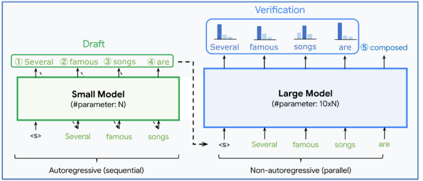
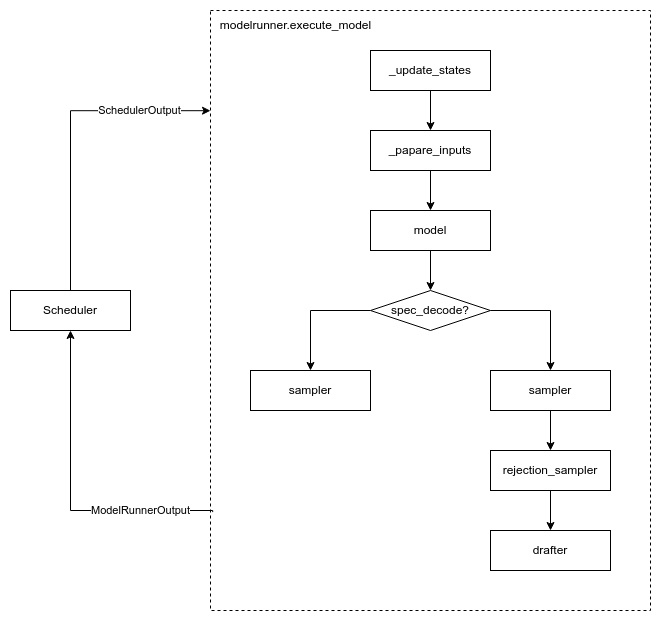
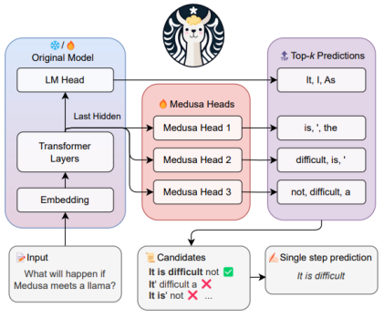
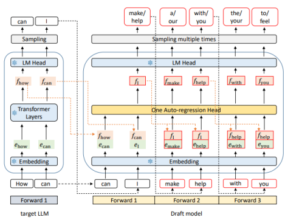
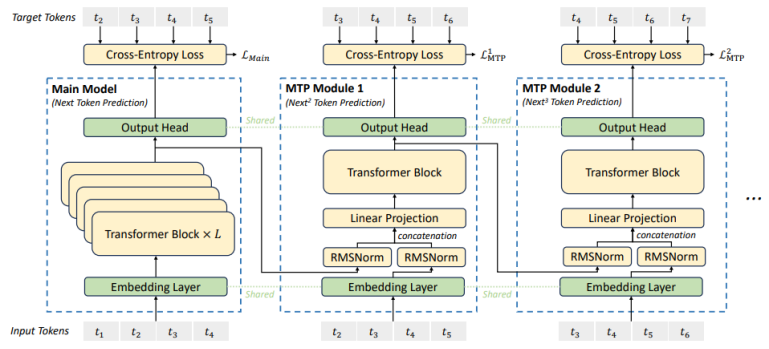

# 投机解码

## 投机解码的流程

投机采样依赖一个小模型（草稿模型），在推理中主要分两个阶段：
- **Draft 阶段**：采用草稿模型，以并行或自回归的方式生成多个后续token，即Draft token。
- **Verify 阶段**：使用目标模型验证 Draft Tokens 序列并生成修正token




## vLLM支持的draft模型

- **ngram**：Token-Level的draft模型，如KMP算法，输入的token: [1,2,3,4,5,2,3]，匹配的n-gram长度为2，输出的最大长度为4，那最后2个token[2,3]就会从前面的token[1,2,3,4,5]去匹配。找到一个匹配处后就会输出后面的4个token，在这里就会输出[4,5,2,3]。
- **Medusa**：Feature-Level的draft模型，输入为最后一层最后一个token的特征，在模型上外挂额外n个解码头分别其余预测未来n个时间步的token。
- **Eagle**：Token-Level+Feature-Level的draft模型，输入为前面所有token的特征和当前预测token，从而将采样带来的未知性考虑进来。里面是一层transformer层，正常和目标模型的layer同构，在draft阶段进行n次自回归计算去预测未来n个时间步的token。**现在有eagle、eagle3和mtp三类实现**。


## vLLM执行流程

vllm一个迭代的推理过程如下：


1. **Scheduler**根据请求执行情况、block资源等决定当前batch执行哪些请求以及对应的资源分配，封装在SchedulerOutput中发送给modelrunner。
2. **modelrunner**先根据SchedulerOutput中的信息更新下本地缓存的请求状态
3. 本地缓存的请求相关状态和参数更新后，就可以为本次模型执行准备输入
4. 执行**model**输出本次执行所有token的hidden_states，计算所有需要的logits
5. 如果没有开启spec_decode，**sampler**直接对着logits采样出token即可
6. 如果开启了spec_decode，**sampler**会先对着每个请求的最后一个token的logits采样出token
7. **rejection_sampler**根据logits进行verify，配合上一步采样的token生成verify阶段的最终输出
8. **草稿模型drafter**根据修正的输出、这次执行所有token的hidden_state生成draft阶段的草稿token
9. 将本次执行生成的token和draft token打包成ModelrunnerOutput，发送给Scheduler

至此，一个迭代就完成了。


## spec_decode相关实现

### update_state阶段
model_runner会在本地input_batch中缓存请求的所有token和token数，上一轮为该请求生成的草稿token会在这会儿更新进去。
```python
def _update_states
    ......
    # ZQJ 将上一轮的草稿token添加到输入token的缓存中
    spec_token_ids = (
        scheduler_output.scheduled_spec_decode_tokens.get(req_id, ()))
    if spec_token_ids:
        num_spec_tokens = len(spec_token_ids)
        # num_tokens_no_spec缓存请求的当前非草稿token数
        start_index = self.input_batch.num_tokens_no_spec[req_index]
        end_token_index = start_index + num_spec_tokens
        # token_ids_cpu缓存的请求的所有token
        self.input_batch.token_ids_cpu[
            req_index, start_index:end_token_index] = spec_token_ids
        # NOTE(woosuk): `num_tokens` here may include spec tokens.
        # num_tokens缓存请求的所有token数
        self.input_batch.num_tokens[req_index] += num_spec_tokens
    ......
```

**QA：**
为什么不在上一轮生成草稿token时就更新？
上一轮生成草稿token的请求这一轮可能就被抢占了，在知道Scheduler调度结果后再更新可以避免无效计算
草稿token会有修正，导致部分被抛弃，为什么这会儿要更新进去？
本身在模型执行阶段草稿token是被当做正常token计算的，这会儿更新进行可以在prepare阶段被正常计算对应输入。在rejection_sampler阶段还会根据修正后的结果再次更新

### prepare_inputs阶段
这个阶段会生成一个spec_decode_metadata数据，根据数据类就能知道它的大概作用：
```python
@dataclass
class SpecDecodeMetadata:
    # cu_num_scheduled_tokens:  [  4, 104, 107, 207, 209]

    # [num_tokens]
    draft_token_ids: torch.Tensor

    # 每个请求上一波生成的草稿token数量
    # [  3,   0,   2,   0,   1]
    # [batch_size]
    num_draft_tokens: list[int]

    # [  3,   3,   5,   5,   6]
    # [batch_size]
    cu_num_draft_tokens: torch.Tensor

    # 所有需要参与rejection计算的token的token在len(logits_indices)中的索引
    # [  0,   1,   2,   5,   6,   9]
    # [num_tokens]
    target_logits_indices: torch.Tensor

    # 所有计算出的logits中每个请求最后一个token的在len(logits_indices)的索引 
    # [  3,   4,   7,   8,  10]
    # [batch_size]
    bonus_logits_indices: torch.Tensor
    
    # 所有需要计算logits的token在len(input_ids)中的索引
    # [  0,   1,   2,   3, 103, 104, 105, 106, 206, 207, 208]
    # [num_tokens + batch_size]
    logits_indices: torch.Tensor
```

注：vLLM使用chunk prefill，即把输入的一个batch的token平铺成一维作为模型的输入，最后输出的hidden_states维度也是[len(input_ids), hidden_size]，所以logits_indices会是这样的一个索引


### 执行model阶段
model执行完后，我们会得到所有input_ids最后一层的hidden_states或aux_hidden_states（多层的hidden_states，供eagle3使用），这会儿就会使用logits_indices去索引hidden_states去计算所有需要的logits。
```python
        # Run the model.
        # Use persistent buffers for CUDA graphs.
        with set_forward_context(
                attn_metadata,
                self.vllm_config,
                num_tokens=num_input_tokens,
                num_tokens_across_dp=num_tokens_across_dp,
                cudagraph_runtime_mode=cudagraph_runtime_mode,
                batch_descriptor=batch_descriptor,
        ), self.maybe_get_kv_connector_output(
                scheduler_output) as kv_connector_output:
            model_output = self.model(
                input_ids=input_ids,
                positions=positions,
                intermediate_tensors=intermediate_tensors,
                inputs_embeds=inputs_embeds,
                **model_kwargs,
            )

        if self.use_aux_hidden_state_outputs:
            hidden_states, aux_hidden_states = model_output
        else:
            hidden_states = model_output
            aux_hidden_states = None

        ......
            # ==============================================================
            # ZQJ 提取所有需要计算logits的token的hidden_states
            sample_hidden_states = hidden_states[logits_indices]
            logits = self.model.compute_logits(sample_hidden_states, None)
```


### sampler阶段
计算出logits后，通过bonus_logits_indices索引到每个请求的最后一个logit，sampler对其进行采样，这里是先假设所有draft token都会接受，计算出修正的token。
```python
bonus_logits = logits[spec_decode_metadata.bonus_logits_indices]
sampler_output = self.sampler(
    logits=bonus_logits,
    sampling_metadata=sampling_metadata,
)
bonus_token_ids = sampler_output.sampled_token_ids
```

### rejection_sampler阶段
通过target_logits_indices从logits索引到所有需要参与rejection计算的token的logits，最后结合bonus_token_ids生成最后的修正输出：
```python
# ==============================================================
# ZQJ 对上一回合的草稿token进行拒绝采样
target_logits = logits[spec_decode_metadata.target_logits_indices]
output_token_ids = self.rejection_sampler(
    spec_decode_metadata,
    None,  # draft_probs
    target_logits,
    bonus_token_ids,
    sampling_metadata,
)
sampler_output.sampled_token_ids = output_token_ids
```


### drafter阶段
verify完后我们就可以根据修正后的token和这次执行的token的hidden_states生成draft阶段的草稿token了。也只有这边我们需要关心草稿模型是如何实现的了。

#### ngram
ngram实现比较简单，只需要从本地缓存的请求token末尾取出num_tokens_no_spec个token即可完成。

#### Medusa
Medusa在原始模型最后一个隐藏层后添加额外的解码头，第 i 个 Medusa Head 负责预测当前预测 token 之后的第 i 个token。



计算也不是很复杂，只要找到每个请求最后一个修正token的hidden_states即可。
```python
elif self.speculative_config.method == "medusa":
    assert isinstance(self.drafter, MedusaProposer)
    if sample_hidden_states.shape[0] == len(sampled_token_ids):
        # The input to the target model does not include draft tokens.
        hidden_states = sample_hidden_states
    else:
        indices = []
        offset = 0
        for num_draft, tokens in zip(
                spec_decode_metadata.num_draft_tokens,
                sampled_token_ids):
            indices.append(offset + len(tokens) - 1)
            offset += num_draft + 1
        indices = torch.tensor(indices, device=self.device)
        hidden_states = sample_hidden_states[indices]

    spec_token_ids = self.drafter.propose(
        target_hidden_states=hidden_states,
        sampling_metadata=sampling_metadata,
    )
```

#### eagle or MTP
vllm里是将MTP和eagle合并到一起了，因为它们确实有很多共通之处，输入都是前面所有token的hidden_states和后移一个时间步的token，都包含和目标模型同构的transformer层，不过eagle是使用n次自回归去生成n个draft token，而MTP是通过扩充MTP层数去生成对应数量的draft token（目前开源的deepseek只有一层）。
eagle：

MTP:


让我们专注于draft模型的transformer层，输入来源是前面所有token的hidden_states和后移一个时间步的embedding concat后再降维得到的。
首先，decoder的transformer是满足因果性的，即当前位置的输出只和前面位置的输入有关，也就是说，在相同token下，输入到draft模型的hidden_states和embedding是相同的，加上draft模型本身也是包含一个decoder的transformer层，也就是说，我们是可以对eagle或者MTP使用kv cache进行加速。既然都可以使用kv cache，kv block、chunk prefill、前缀缓存都是可以使用的。

我们可以搞一个简短的例子，从单层MTP的角度去看。
block大小：4
先从一个请求开始看：
seq 1：
[1, 2, 3, 4| 5, 6, 7, 8| 9, 10]

假设prefill完成，输出的token是11，此时给MTP的输入是：
[h1, h2, h3, h4| h5, h6, h7, h8| h9, h10]
[e2, e3, e4, e5| e6, e7, e8, e9| e10, e11]
注：MTP会把特征序列和embeddingRMSNorm后再concat在经过一个linear降维到hidden_size后才变成transformer layer的输入，不影响他们的之间的等价性，即layer在token1位置的输入等价于h1+e2

再后续decode过程中，假上一轮的draft token是12，修正后把12放弃，修正token为13，此时给MTP的输入是：
[h1, h2, h3, h4| h5, h6, h7, h8| h9, h10, h11]
[e2, e3, e4, e5| e6, e7, e8, e9| e10, e11, e13]

不难看出，token10及之前位置的kv cache是可以复用的，不需要再重新计算而token11位置可以和正常KVCache计算一样
既然开了kv cache，就可以以block的方式管理，vllm是直接让draft模型复用了模板模型block table的映射关系，不需要担心draft模型的块不够用，因为draft模型处理的token数只会≤目标模型的处理的token数（rejection阶段可能会有部分token被抛弃）

同理，开了kv block，我们也可以开前缀缓存。
假设再来一个请求：
seq 2:
[1, 2, 3, 4| 5, 6, 7, 8| 10]
单从目标模型的角度看，前两个块是可以复用的
假设prefill完成，输出的token是11，此时给MTP的输入是：
[h1, h2, h3, h4| h5, h6, h7, h8| h10]
[e2, e3, e4, e5| e6, e7, e8, e10| e11]
从draft模型角度看，只有第一个块可以复用（因为输入的embedding会后移一个时间步）

对此，vllm的解决方法简单粗暴，如果开了eagle的话，在模板模型匹配的块的基础上把最后一个块去掉，这样保证了kv block的管理上目标模型和draft模型的一致性，这样就可以让MTP去复用目标模型的layer实现，复用模板模型的KV映射关系，减少了很多计算的复杂性。

```python
if use_eagle and computed_blocks[0]:
    for computed in computed_blocks:
        computed.pop()
return computed_blocks
```

最后回到chunk prefill上，假设seq 1被chunk了，只有前3个token1，2，3被送进去计算。这三个token会计算对应的kv cache并保留。对于MTP也是同理，它也只需要计算对应的kv cache供后续使用。输入也很好构造
[h1, h2, h3] # 这次的计算结果
[e2, e3, e4] # e4可以从seq1的prompt里取到token4算出来

可行性分析完后，我们就可以去看对应的代码实现了


<details>
<summary>vLLM deepseek_mtp类实现</summary>


```python
from collections.abc import Iterable
from typing import Optional

import torch
import torch.nn as nn
from transformers import PretrainedConfig

from vllm.config import CacheConfig, ModelConfig, VllmConfig
from vllm.model_executor.layers.fused_moe import FusedMoE
from vllm.model_executor.layers.layernorm import RMSNorm
from vllm.model_executor.layers.logits_processor import LogitsProcessor
from vllm.model_executor.layers.quantization import QuantizationConfig
from vllm.model_executor.layers.vocab_parallel_embedding import (
    ParallelLMHead, VocabParallelEmbedding)
from vllm.model_executor.model_loader.weight_utils import default_weight_loader
from vllm.model_executor.sampling_metadata import SamplingMetadata
from vllm.sequence import IntermediateTensors

from .deepseek_v2 import (DeepseekV2DecoderLayer,
                          get_spec_layer_idx_from_weight_name)
from .interfaces import SupportsPP
from .utils import maybe_prefix


class SharedHead(nn.Module):

    def __init__(
        self,
        config: PretrainedConfig,
        quant_config: Optional[QuantizationConfig] = None,
    ) -> None:
        super().__init__()
        self.norm = RMSNorm(config.hidden_size, eps=config.rms_norm_eps)
        self.head = ParallelLMHead(config.vocab_size,
                                   config.hidden_size,
                                   quant_config=quant_config)

    def forward(self, hidden_states: torch.Tensor) -> torch.Tensor:
        return self.norm(hidden_states)


class DeepSeekMultiTokenPredictorLayer(nn.Module):

    def __init__(
        self,
        config: PretrainedConfig,
        prefix: str,
        model_config: ModelConfig,
        cache_config: Optional[CacheConfig] = None,
        quant_config: Optional[QuantizationConfig] = None,
    ) -> None:
        super().__init__()
        self.enorm = RMSNorm(config.hidden_size, eps=config.rms_norm_eps)
        self.hnorm = RMSNorm(config.hidden_size, eps=config.rms_norm_eps)
        self.eh_proj = nn.Linear(config.hidden_size * 2,
                                 config.hidden_size,
                                 bias=False)
        self.shared_head = SharedHead(config=config, quant_config=quant_config)
        # ==========================
        # 此处直接用的deepseek layer的实现
        self.mtp_block = DeepseekV2DecoderLayer(config, prefix, model_config,
                                                cache_config, quant_config)

    def forward(
        self,
        input_ids: torch.Tensor,
        positions: torch.Tensor,
        previous_hidden_states: torch.Tensor,
        inputs_embeds: Optional[torch.Tensor] = None,
        spec_step_index: int = 0,
    ) -> torch.Tensor:
        assert inputs_embeds is not None
        # masking inputs at position 0, as not needed by MTP
        inputs_embeds[positions == 0] = 0
        inputs_embeds = self.enorm(inputs_embeds)
        previous_hidden_states = self.hnorm(previous_hidden_states)

        hidden_states = self.eh_proj(
            torch.cat([inputs_embeds, previous_hidden_states], dim=-1))

        hidden_states, residual = self.mtp_block(positions=positions,
                                                 hidden_states=hidden_states,
                                                 residual=None)
        hidden_states = residual + hidden_states
        return hidden_states


class DeepSeekMultiTokenPredictor(nn.Module):

    def __init__(self, *, vllm_config: VllmConfig, prefix: str = ""):
        super().__init__()
        config = vllm_config.model_config.hf_config
        self.mtp_start_layer_idx = config.num_hidden_layers
        self.num_mtp_layers = config.num_nextn_predict_layers
        # to map the exact layer index from weights
        self.layers = torch.nn.ModuleDict({
            str(idx):
            DeepSeekMultiTokenPredictorLayer(
                config,
                f"{prefix}.layers.{idx}",
                model_config=vllm_config.model_config,
                cache_config=vllm_config.cache_config,
                quant_config=vllm_config.quant_config,
            )
            for idx in range(self.mtp_start_layer_idx,
                             self.mtp_start_layer_idx + self.num_mtp_layers)
        })
        self.embed_tokens = VocabParallelEmbedding(
            config.vocab_size,
            config.hidden_size,
        )
        self.logits_processor = LogitsProcessor(config.vocab_size)

    def forward(
        self,
        input_ids: torch.Tensor,
        positions: torch.Tensor,
        previous_hidden_states: torch.Tensor,
        inputs_embeds: Optional[torch.Tensor] = None,
        spec_step_idx: int = 0,
    ) -> torch.Tensor:
        if inputs_embeds is None:
            inputs_embeds = self.embed_tokens(input_ids)
        current_step_idx = (spec_step_idx % self.num_mtp_layers)
        return self.layers[str(self.mtp_start_layer_idx + current_step_idx)](
            input_ids,
            positions,
            previous_hidden_states,
            inputs_embeds,
            current_step_idx,
        )

    def compute_logits(
        self,
        hidden_states: torch.Tensor,
        sampling_metadata: SamplingMetadata,
        spec_step_idx: int = 0,
    ) -> torch.Tensor:
        current_step_idx = (spec_step_idx % self.num_mtp_layers)
        mtp_layer = self.layers[str(self.mtp_start_layer_idx +
                                    current_step_idx)]
        logits = self.logits_processor(mtp_layer.shared_head.head,
                                       mtp_layer.shared_head(hidden_states),
                                       sampling_metadata)
        return logits


class DeepSeekMTP(nn.Module, SupportsPP):

    def __init__(self, *, vllm_config: VllmConfig, prefix: str = ""):
        super().__init__()
        self.config = vllm_config.model_config.hf_config
        self.model = DeepSeekMultiTokenPredictor(vllm_config=vllm_config,
                                                 prefix=maybe_prefix(
                                                     prefix, "model"))

    def forward(
        self,
        input_ids: torch.Tensor,
        positions: torch.Tensor,
        hidden_states: torch.Tensor,
        intermediate_tensors: Optional[IntermediateTensors] = None,
        inputs_embeds: Optional[torch.Tensor] = None,
        spec_step_idx: int = 0,
    ) -> torch.Tensor:
        hidden_states = self.model(input_ids, positions, hidden_states,
                                   inputs_embeds, spec_step_idx)
        return hidden_states

    ......

```
</details>


eagle部分的处理逻辑：
```python
elif self.speculative_config.use_eagle():
    assert isinstance(self.drafter, EagleProposer)
    # TODO(woosuk): Refactor the loop.
    next_token_ids: list[int] = []
    for i, token_ids in enumerate(sampled_token_ids):
        if token_ids:
            # Common case.
            # 正常情况下都会出个token，最后一个是修正token
            next_token_id = token_ids[-1]
        else:
            # Partial prefill (rare case).
            # Get the next token id from the request state.
            # 遇到被chunk的prefill，需要从请求的prompt中找到下一个token，因为eagle模型本身也是类似chunk prefill进行的，也需要把前面的token的kv保存下来
            req_id = self.input_batch.req_ids[i]
            req_state = self.requests[req_id]
            seq_len = (req_state.num_computed_tokens +
                        scheduler_output.num_scheduled_tokens[req_id])
            next_token_id = req_state.get_token_id(seq_len)
        next_token_ids.append(next_token_id)
    next_token_ids = torch.tensor(next_token_ids,
                                    dtype=torch.int32,
                                    device=self.device)

    if spec_decode_metadata is None:
        # input_ids can be None for multimodal models.
        ......
    else:
        # TODO(woosuk): Refactor this.
        num_draft_tokens = spec_decode_metadata.num_draft_tokens
        num_rejected_tokens = [
            n + 1 - len(sampled_token_ids[i]) if n > 0 else 0
            for i, n in enumerate(num_draft_tokens)
        ]
        num_rejected_tokens_cpu = torch.tensor(num_rejected_tokens,
                                                dtype=torch.int32)
        # draft模型的输入需要调整为修正过的
        # 如这一次seq1的输入为[0,1,2,3],后三个是draft token，最后一个token被剔了
        # 则传给draft模型的target_token_id为[0,1,2]
        # common_attn_metadata，target_hidden_states都需要在这个逻辑上调整，去除被剔除的draft token所占用的部分
        common_attn_metadata, token_indices =\
            self.drafter.prepare_inputs(
            common_attn_metadata, num_rejected_tokens_cpu)

        target_token_ids = self.input_ids[token_indices]
        # TODO(woosuk): Support M-RoPE.
        target_positions = self.positions[token_indices]
        if self.use_aux_hidden_state_outputs:
            target_hidden_states = torch.cat(
                [h[token_indices] for h in aux_hidden_states], dim=-1)
        else:
            target_hidden_states = hidden_states[token_indices]
    mm_embeds = None
    if self.supports_mm_inputs:
        mm_embeds = self._gather_mm_embeddings(scheduler_output,
                                                shift_computed_tokens=1)

    draft_token_ids = self.drafter.propose(
        target_token_ids=target_token_ids,
        target_positions=target_positions,
        target_hidden_states=target_hidden_states,
        next_token_ids=next_token_ids,
        sampling_metadata=sampling_metadata,
        common_attn_metadata=common_attn_metadata,
        mm_embeds=mm_embeds,
    )
    spec_token_ids = draft_token_ids.tolist()
return spec_token_ids
```